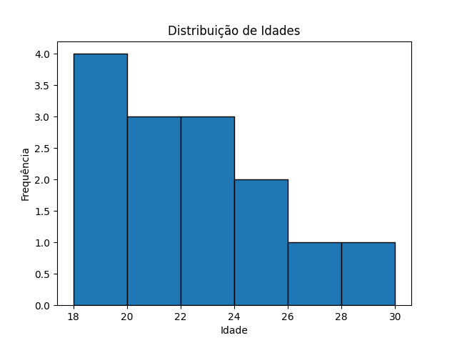
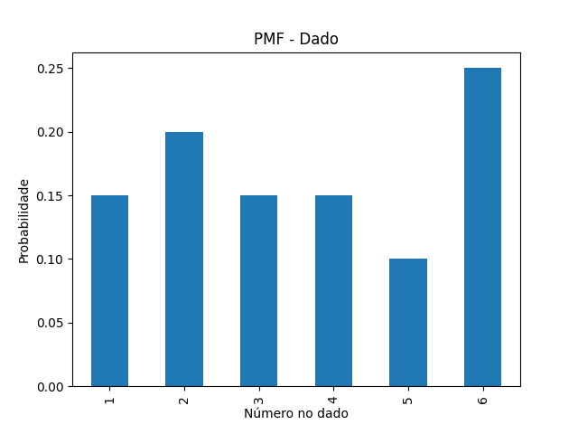
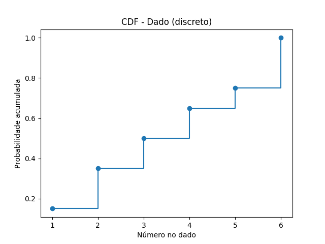
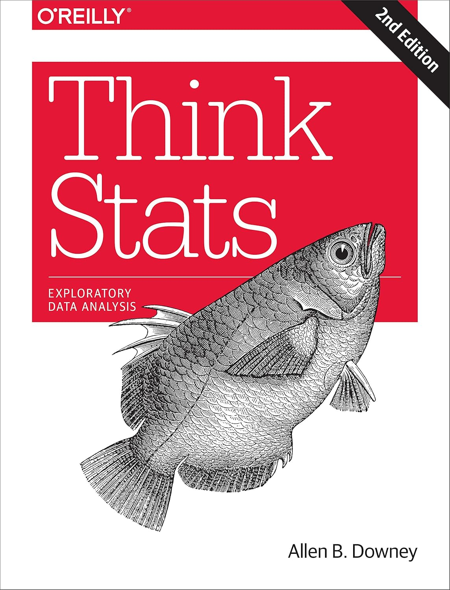

# 📈 Estatística com Python  

          

Este repositório reúne meus estudos de **estatística aplicada em Python**, baseado no livro *Think Stats: Probability and Statistics for Programmers (2ª edição)*, de Allen B. Downey. O objetivo é consolidar conceitos de probabilidade e estatística em notebooks bem documentados com exemplos práticos e visualizações.

---

##  Estrutura do Repositório
- `notebooks/` → notebooks Jupyter com explicações, código e gráficos.  
- `scripts/` → arquivos `.py` para execução rápida dos exemplos.  
- `images/` → gráficos e a capa do livro.  
- `data/` → datasets usados (quando necessário).  
- `requirements.txt` → dependências para recriar o ambiente.

---

##  Capítulos Concluídos
- [01 - Introdução & EDA](notebooks/01_intro_eda.ipynb)  
  Estatísticas descritivas e histograma de dados de idade.  
  

- [02 - Centralidade & Dispersão](notebooks/02_central_disp.ipynb)  
  Média, mediana, moda, variância, desvio-padrão e boxplot.  
  

- [03 - PMF, CDF e PDF](notebooks/03_pmf_cdf_pdf.ipynb)  
  Funções de distribuição de variáveis discretas (dado), acumuladas (CDF) e contínuas (normal).  
   

---

##  Objetivo
- Desenvolver uma base sólida em **estatística aplicada** com Python.  
- Construir um portfólio prático e incremental, especialmente voltado para **finanças e Data Science**.  
- Registrar todo o processo de aprendizagem de forma organizada e visualmente clara.

---

##  Referência
Estudos baseados em *Think Stats: Probability and Statistics for Programmers (2ª edição)*  
✍️ Allen B. Downey  

---

✍️ **Autor:** Miguel Reis  
🎯 Foco: desenvolvimento contínuo em Estatística e Data Science aplicada.
